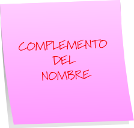
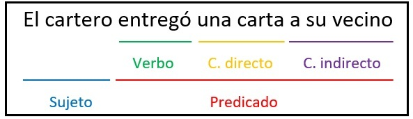
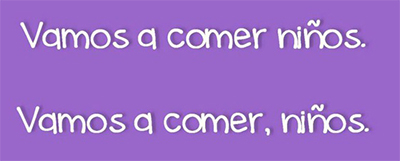
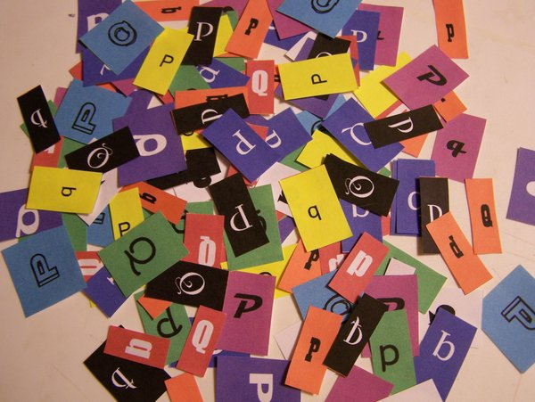

## La lengua checa tiene siete casos o declinaciones:

### 
1. Nominativo
2. Genitivo 
3. Dativo 
4. Acusativo 
5. Vocativo 
6. Locativo
7. Instrumental

---

## 1.Nominativo

---

Es la palabra tal y como aparece en el diccionario. Se utiliza en el sujeto de las oraciones y también se utiliza con el verbo ser. También se usa en el sujeto paciente.

Ejemplos

+ **Já** miluju tvou matku (**Yo** amo a tu madre).
+ **Má sestra** je **inteligentní** (**Mi hermana** es **inteligente**).
+ **To** se rozumí (**Eso** se entiende)
+ **Ta univerzita** byla postavena v roce 1322 (**Esta universidad** fue construida en el aňo 1322).

---

## 2. Genitivo

---

Equivale a un **complemento nominal** (*el padre de Ana, el libro de cocina*).

También se usa después de la mayoría de las preposiciones: 

+  "Od" desde o de (para expresiones de tiempo o de posesión)
+  "z" desde (para lugar)
+  "do" hasta
+  "bez" sin
+  "blízko" cerca
+  "u" al lado de
+  "místo" en vez de

---

## 3. Dativo

 

---

Equivale al **complemento indirecto**.

Se usa detrás de algunas preposiciones como:

+ "Kvůli" por causa de 
+ "Díky" gracias a
+  En algunos verbos como:
   +   Děkovat --> agradecer
   +   Rozumět --> entender 
   +   Věřit --> creer 

---

## 4. Acusativo 

---

Equivale al **complemento directo**. La mayoría de los verbos llevan acusativo. 
También se usa detrás de las preposiciones:

+ "na" a, hacia
+ "pro" para 
+ "za" dentro de... un tiempo. 

---

## 5. Vocativo

---

Sólo se usa para llamar a las personas o a los animales. Es decir, **lo usamos cuando queremos que nos presten atención**. Es el más fácil de todos los casos y nunca va acompañado de preposición.

Unos ejemplos:

+ *Juane, podívej se na mě!* – ¡Juan, mírame!
+ *Vaše Výsosti, vítáme Vás v Praze!* – ¡Su alteza, bienvenido a Praga!
+ *Nino, sedni!* – ¡Nino, siéntate! 

---

## 6. Locativo

---

Lo usamos siempre acompañado de una preposición. Lo usamos cuando indicamos un lugar, una posición estática (para una posición en movimiento no vale). 
La preposiciones más comunes son: 

+ "v" en...un lugar 
+ "na" sobre...un mueble...
+ "o" acerca de

---

## 7. Instrumental

---

Lo utilizamos para indicar un modo o instrumento. También puede estar sin preposición. Sin preposición responde las preguntas: «¿por medio de quién?» o «¿por medio de qué?», en relación con el verbo.

Con preposición:

+ "s" con 

Ejemplo: *Pojedu s sestrou* (Iré con mi hermana).

Sin preposición:

Ejemplo: *Jet vaklem* (en tren) Por medio de qué viajo.

--- 

## Gracias