# Capítulo 1: Primeros Pasos 

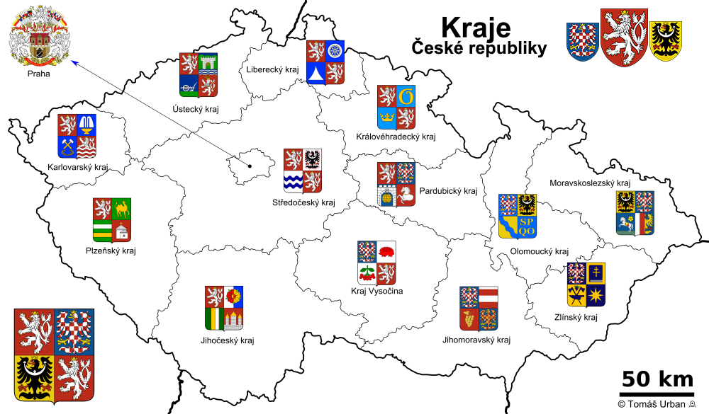
```
Ahoj! estás cada vez más cerca de poder moverte y -sobre todo- comunicarte en Praga. 
En esta brevísima guía encontrarás contenido básico de expresiones habituales, algunos lugares interesantes y un mapa que te puede ayudar en tu periplo.
¡Qué lo disfrutes!
```
## 1.0 Praga

Es la capital de **la República Checa** y está ubicada a orillas del río *Moldava*.


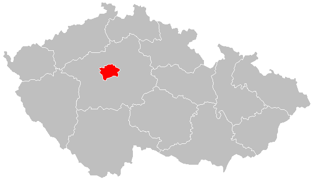

Es conocida por su gran belleza y patrimonio histórico.

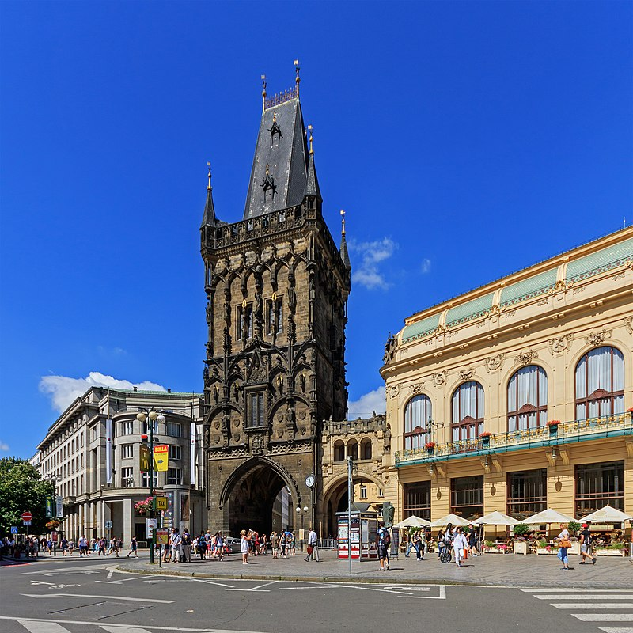

❗ *El castillo de Praga es el más grande del mundo*

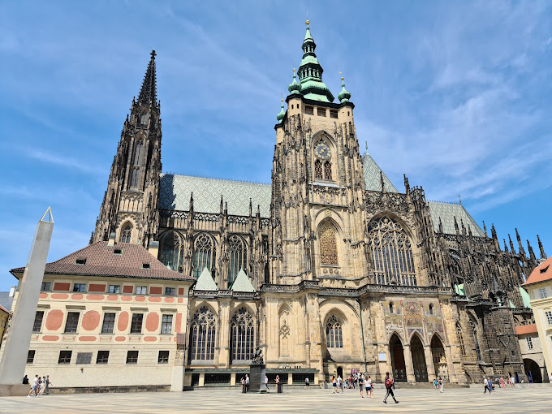

## 1.1 Saludos y despedidas
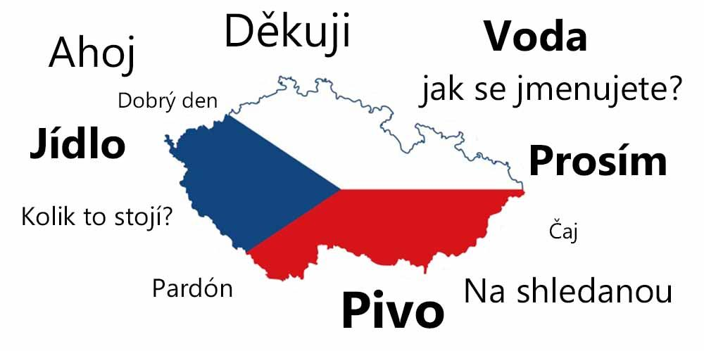
 *Recuerda que la cortesía no es entendida del mismo modo en las culturas occidentales, así que no dudes en utilizar **gracias** y **por favor** tan a menudo como quieras.* 

 **Saludos**

 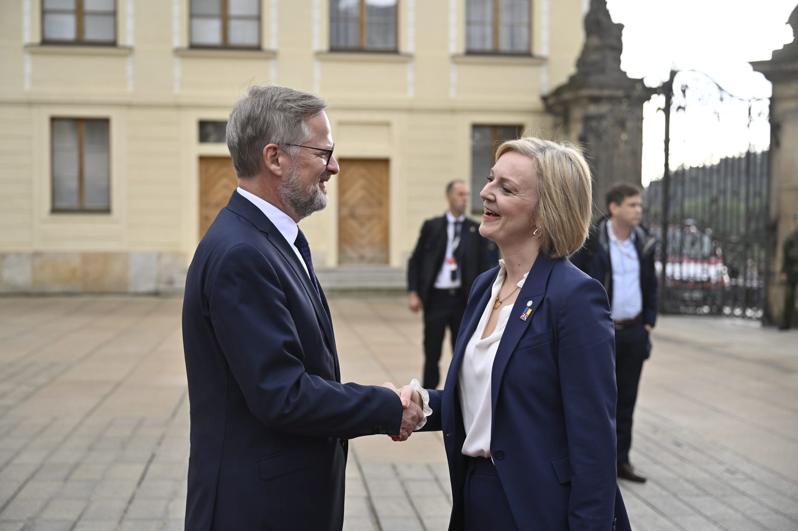

>Hola! encantado **Ahoj! Velmi rád!**

>¿Qué tal? **Jak se máte?**

>Bien, gracias **Dobře, děkuji**

>Buenos días **Dobrý den**

>Buenas tardes  **Dobré odpoledne**

>Buenas noches **Dobrý veèer**

❗ *Cabe destacar que en **la República Checa** se puede utilizar el saludo "dobrý den" durante todo el día.*

 **Despedidas**

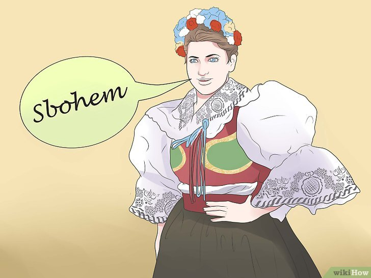

>Adiós, nos vemos! **Na shledanou!Tak zatím**

>Adiós y hasta nunca! **sbohem a šáteček** ~~por si estás despechad@~~

> Adiós! **Sbohem**


## 1.2 Frases básicas de cortesía


>Encantad@. Mucho gusto. **Těší mě**

>Por favor. Disculpa/e. De nada. **Prosím**

> Gracias. **Děkuji/u**

> Gracias (informal). **Díky** 😄

>Muchas gracias. **Mockrát děkuji/u**

>Mil gracias. **Tisíceré díky**

>Disculpe usted. **Promiňte**

>No se moleste. **Nezlobte se**

>lo siento 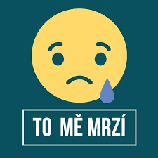

❗Si quieres ahondar en tu conocimiento del vocabulario, puedes visitar este [sitio](https://issuu.com/hernan973/docs/checo-palabras-frecuentes).


## 1.3 Números 🔢

|  Número | Checo |Pronunciación
| ---------|------|------------
| 1    |Jedna      |"Lledna"
| 2   |Dvě     |	"Devie"
| 3     |Tři | "Tsrsi" (la letra "ř" se lee como una "r" y "s" a la vez)
| 4     |Čtyři   |  	"Chitisrsi"
| 5    |Pět    | "Piet"
| 6   |Šest     | "Shest"
| 7   |Sedm   | "Sedum"
| 8    | Osm| "Osum"   
| 9   |Devět   |  "Deviet"
| 10    |Deset| "Deset"

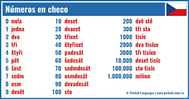

❗ Si quieres practicar la pronunciación, puedes ver este [video](https://www.youtube.com/watch?app=desktop&v=6XuyJxUlVfg).


## 1.4 Días de las semana 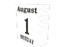

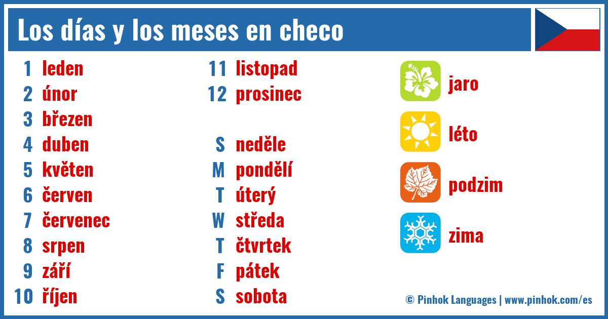

❗*Recuerda que en algunas culturas el primer día es el domingo 😕*