# Capítulo 2: Moverse por Praga 🏃 🚌 🚗 🚲

 Sabemos que no es cosa fácil ubicarse en una ciudad desconocida. Probablemente querrás visitar los sitios más llamativos o tan solo llegar al centro histórico o [La plaza de la ciudad vieja](https://www.google.com/maps/place/Iglesia+de+T%C3%BDn/@50.0874682,14.4207565,17z/data=!4m15!1m8!3m7!1s0x470b94e93e1fa817:0x58841cb69a51337!2zU3Rhcm9txJtzdHNrw6kgbsOhbS4sIDExMCAwMCBTdGFyw6kgTcSbc3RvLCBDaGVxdWlh!3b1!8m2!3d50.0874682!4d14.4207565!16s%2Fg%2F1tl4brd4!3m5!1s0x470b936721e269bb:0x8afc5f9c6346421c!8m2!3d50.0874019!4d14.4228323!16zL20vMGRqNjY5?entry=ttu). Es por eso que te acá te dejamos un contenido útil para moverte por la ciudad. 

 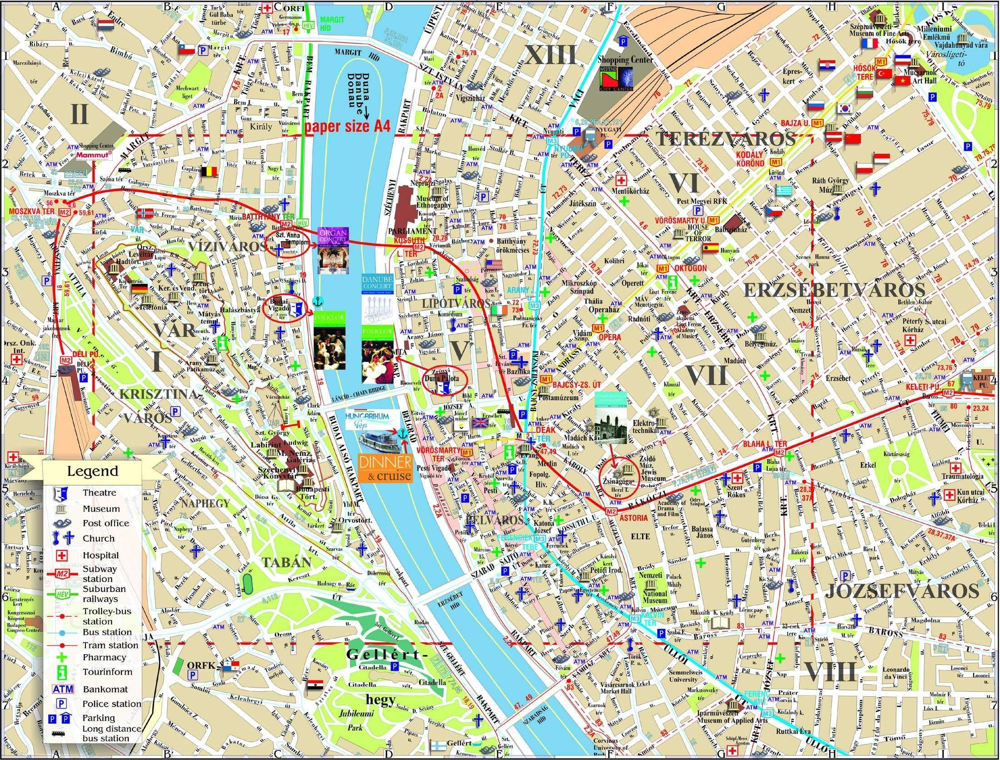

## 2.1 Direcciones, ¿cómo pedirlas?
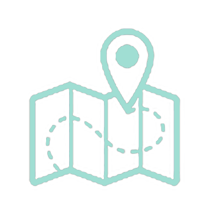
 
>¿En qué dirección? **V jakém směru?**

>¿Dónde está el Puente de Carlos? 
**Kam jde Karlův most?**
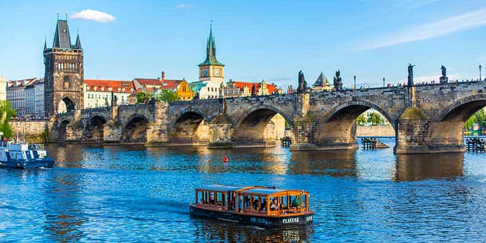

>¿Dónde está el metro? **Kde je metro?** 

>Parada **Zastávka**
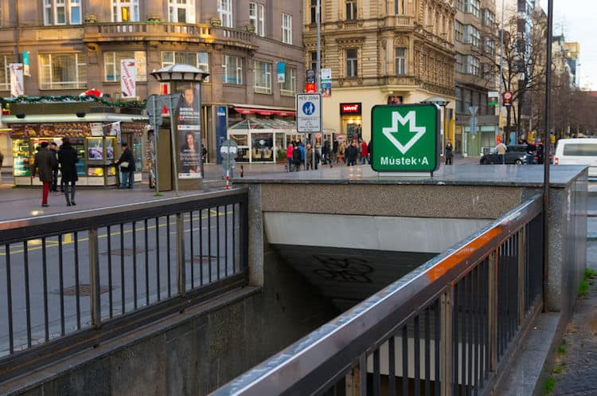


>Estación **Nádraží**

 **Las estaciones de intercambio**

❗ Es bueno tener en cuenta los nombres de las estaciones de intercambio, que le permitirán pasar de una línea a otra en unos minutos:

- *Museo* (permite el cambio de la línea roja a la línea verde)
- *Mustek* (cambio de línea amarilla a verde)
- *Florenz* (cambio de línea amarilla a roja)

Para realizar tu cambio, busque la palabra **prestup** que significa “conexión”.

## 2.2 Indicaciones básicas 


> Aquí->  **Zde**

> Allí ->   **Tam**

>Izquierda -> **Doleva** 👈

>Derecha -> **Doprava** 👉

>Norte -> **Sever** ☝️

>Sur -> **Jih** 👇

>Este -> **Východ**

>Oeste -> **Západ**

>Todo recto -> **Rovně**  

## 2.3 Medios de transporte
1. **Jízdní kolo**

   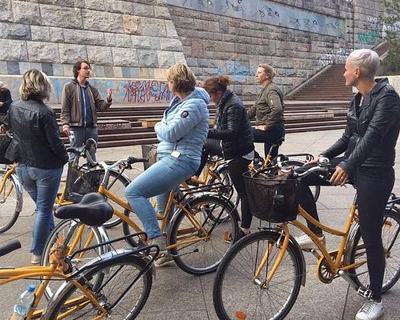
   Por si quieres [rentar](https://www.civitatis.com/es/praga/tour-bicicleta-praga/) una bici.
   ~~publicidad no pagada~~

2. **Auto**
   
   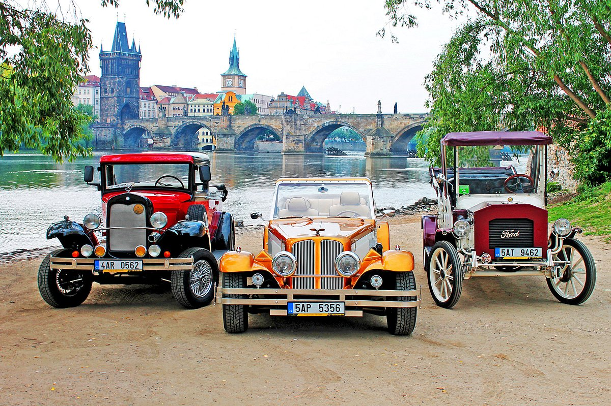

   Por si quieres [rentar](https://www.kayak.cl/Renta-economica-de-autos-Praga.19865.cars.ksp) un automóvil. ~~publicidad no pagada~~

3. **Pražské metro**
   
   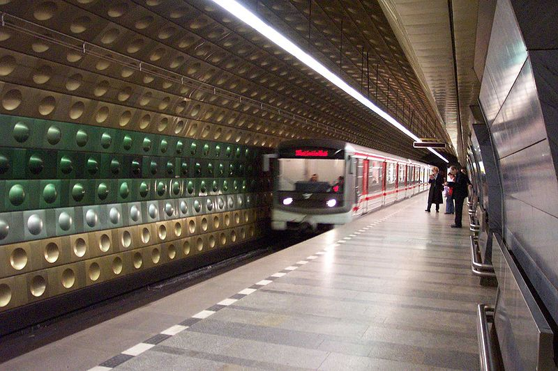
   Te dejo por acá las [líneas de metro](https://czech-transport.com/images/01_metro_orientation_plan.png). 
4. **Taxi**
   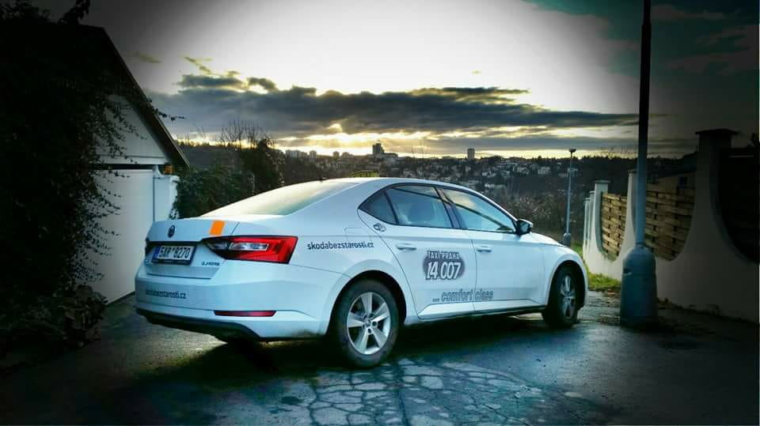
   ❗ Pueden tener distintos colores. 
   Te dejo una [reseña](https://www.prague.eu/es/informacion-practica/en-bicicleta-o-en-taxi-17135) sobre ellos y las bicicletas.

5. **Tranvías**
   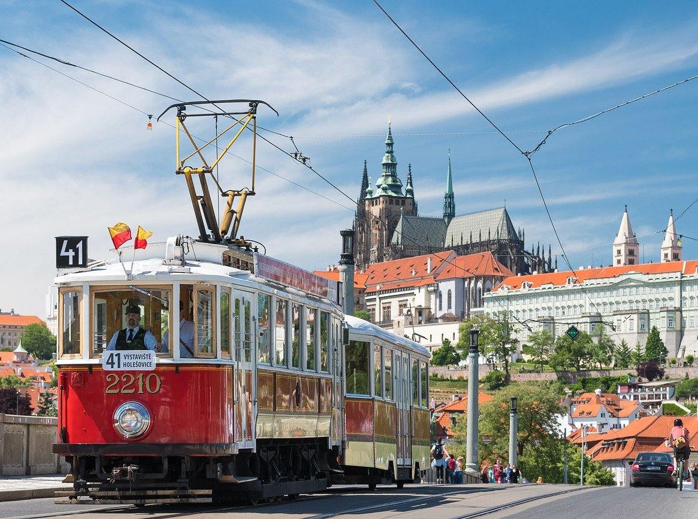
   Por [acá](https://www.disfrutapraga.com/tranvias) más información.

6. **Funicular**
   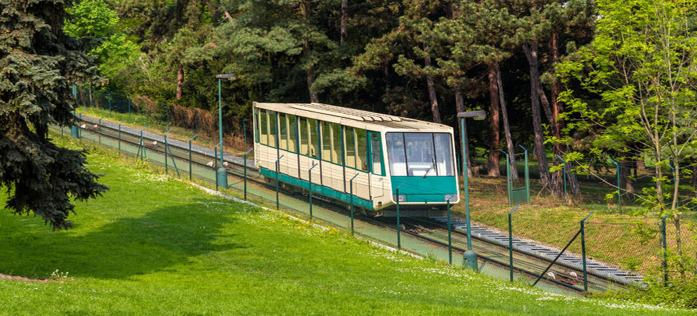
   Para horarios y billetes, [pincha acá](https://www.disfrutapraga.com/funicular-petrin).
   


## 2.4 Comprar billetes

```El billete de metro es el mismo que utilizarás para los autobuses y tranvías: debes comprarlo y validarlo antes de entrar en el metro.```

 **Precios**
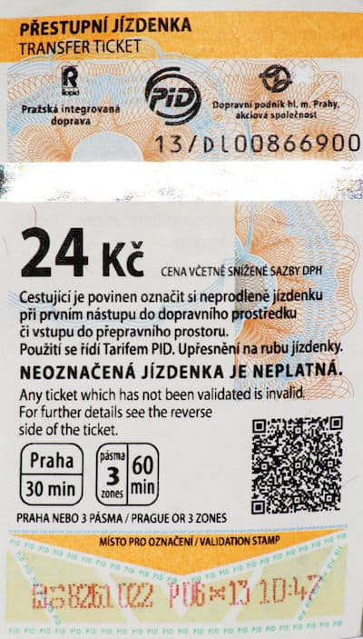

|  Tipo de billete | Adulto |3ra edad
| ---------|------|------------|
| 90 min.| 40 CZK|20 CZK| 
|  30 min.|30 CZK    |	15 CZK| 
| Día | 120 CZK |60 CZK|
| 72 hrs.| 310 CZK| 
| 1 mes| 550 CZK |
| 3 meses| 1480 CZK|
| 1 año| 3650 CZK|


❗ Los chicos menores de 15 años y mayores de 70 viajan **gratis**.