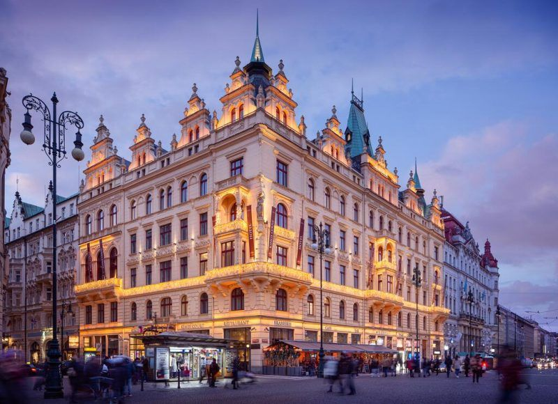
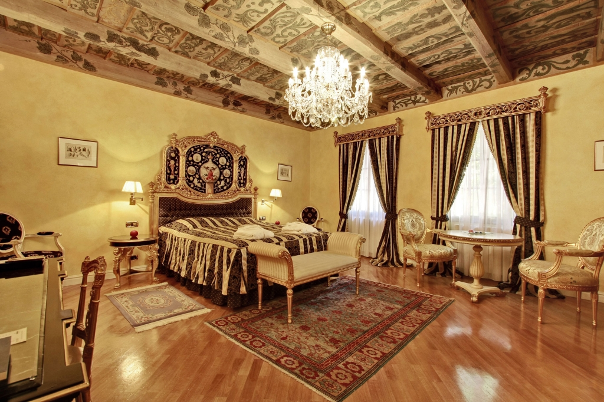
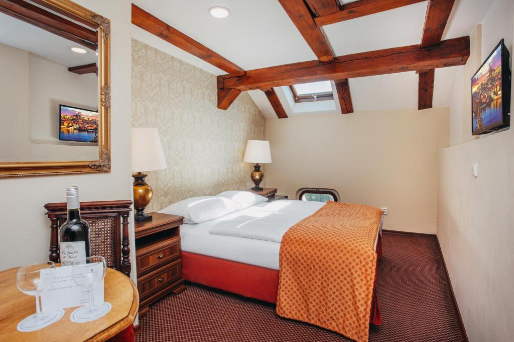
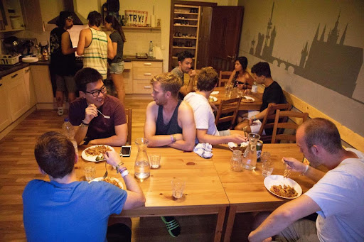
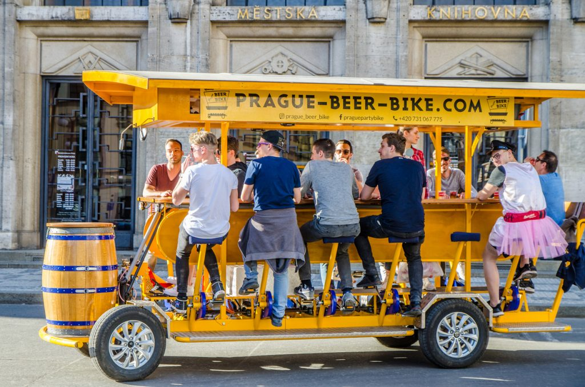
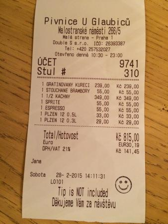

# Capítulo 3: Alojamiento y restaurantes 🛏️🍟 

## 3.1 Reservar alojamiento
Sabemos que el descanso es lo más importante para que tengas un buen viaje, así que te dejamos algunas links para que puedas reservar de acuerdo a tu presupuesto.

1. **Alchymist Grand Hotel and Spa**
   ⭐⭐⭐⭐⭐ 💶 🥇

El primero de esta lista de hoteles de Praga es un alojamiento ubicado en una de las zonas históricas y arquitectónicas más atractivas de la ciudad: **Malá Strana**.

❗Este edificio histórico barroco forma parte de los monumentos protegidos por la UNESCO como Patrimonio de la Humanidad. 
Reserva [aquí](https://www.booking.com/hotel/cz/reshotelalchymistprague.es.html?aid=341145&label=vnmejoreshotelespraga&sid=86ceec7bd31fe18e5e108b83c9edb23f&all_sr_blocks=7714344_89027954_0_2_0;checkin=2024-05-12;checkout=2024-05-17;dest_id=-553173;dest_type=city;dist=0;group_adults=2;group_children=0;hapos=1;highlighted_blocks=7714344_89027954_0_2_0;hpos=1;matching_block_id=7714344_89027954_0_2_0;no_rooms=1;req_adults=2;req_children=0;room1=A%2CA;sb_price_type=total;sr_order=popularity;sr_pri_blocks=7714344_89027954_0_2_0__174300;srepoch=1710017366;srpvid=496092616ba7001e;type=total;ucfs=1&#hotelTmpl). 

2. **Wenceslas Square Hotel**
   ⭐⭐⭐⭐💶 🥈

Situado en el centro de Praga 1, a 100 metros de la plaza de Wenceslao, dispone de restaurante, recepción abierta de 07:00 a 23:00 y WiFi gratuita. El aparcamiento está disponible bajo reserva y por un suplemento.

Las habitaciones son luminosas y están equipadas con TV de pantalla plana, ventilador y baño privado con ducha y artículos de aseo gratuitos.

Reservas [aquí](https://www.booking.com/hotel/cz/wenceslas-square.es.html?aid=341145&label=vnmejoreshotelespraga&sid=86ceec7bd31fe18e5e108b83c9edb23f&all_sr_blocks=113090924_351254461_2_2_0;checkin=2024-05-12;checkout=2024-05-17;dest_id=-553173;dest_type=city;dist=0;group_adults=2;group_children=0;hapos=4;highlighted_blocks=113090924_351254461_2_2_0;hpos=4;matching_block_id=113090924_351254461_2_2_0;no_rooms=1;req_adults=2;req_children=0;room1=A%2CA;sb_price_type=total;sr_order=popularity;sr_pri_blocks=113090924_351254461_2_2_0__80100;srepoch=1710017724;srpvid=496092616ba7001e;type=total;ucfs=1&#hotelTmpl).

3. **Onefam Míru**
⭐⭐⭐ 🥉

El Hostal se encuentra a 2 km del centro de Praga y a tan solo 12 minutos a pie de la Torre de *Televisión de Žižkov.*
Este hostal está aproximadamente a 5 minutos a pie de la parada de autobús la *Na Smetance* y a una distancia media de la estación de metro *Namesti Miru.*

Reservar [aquí](https://www.booking.com/hotel/cz/wandering-praha-b-amp-b.es.html?aid=1607597&label=v3.cltkk5wb6er0408383v95dzoa&sid=86ceec7bd31fe18e5e108b83c9edb23f&all_sr_blocks=46883607_89039984_0_0_0;checkin=2024-05-12;checkout=2024-05-17;dest_id=-553173;dest_type=city;dist=0;group_adults=1;group_children=0;hapos=1;highlighted_blocks=46883607_89039984_0_0_0;hpos=1;matching_block_id=46883607_89039984_0_0_0;no_rooms=1;req_adults=1;req_children=0;room1=A;sb_price_type=total;sr_order=popularity;sr_pri_blocks=46883607_89039984_0_0_0__21169;srepoch=1710018019;srpvid=0a3493a21c3e0270;type=total;ucfs=1&#hotelTmpl)

## 3.2 Pedir comida y bebida 

|  Español | Checo 
| ---------|------|
| Una mesa para _[número de personas]_, por favor.| Stůl pro _[počet osob]_, prosím.
|  ¿Tienen comida vegetariana?! |Nabízíte také vegetariánské pokrmy? 
| ¿Puedo ver el menú?| Mohu vidět menu, prosím?

|  Español | Checo 
| ---------|------|
| ¿Qué nos puede recomendar?| Co nám můžete doporučit?
| ¿Tienen alguna especialidad local?| Máte nějakou místní specialitu?
| Me gustaría un/una _[bebida]_, por favor.| Chtěla bych _[nápoj]_, prosím.

Ojo con la diferencia entre la carta de bebidas, *nápojový lístek*, y el menú, *jídelní lístek*. La palabra "menú" tiene un sentido diferente en checo. Si piden el menú, que es la palabra internacional, sólo que en checo se escribe sin el acento, ello significa que desea el menú del día, no la lista de platos. 🆗

  Bebidas | Checo 
| ---------|------|
| Agua     |voda      |
| Jugo     |džus      |
| Té       |čaj      |
| Vino     |vína     |
| Cerveza      |pivo      |

## 3.3 La cuenta

Luego de comer, puedes pedir al **číšník** la cuenta. O pueden decir: **"Účet, prosím"** "La cuenta, por favor".

>O: **"Zaplatím"** "Voy a pagar". 

Frases más corteses:
 
>**"Můžete mi přinést účet, prosím?"** ¿Me puede traer la cuenta, por favor? 

>**"Mohu zaplatit?"** ¿Puedo pagar?

 >**"Dobrou chuť"** ~~buen provecho~~

❗Por si quieres saber sobre la [propina](https://www.avantgarde-prague.es/se-deja-propina-en-los-restaurantes-en-praga/#:~:text=En%20los%20restaurantes%20de%20Praga,importe%20total%20de%20la%20cuenta.).