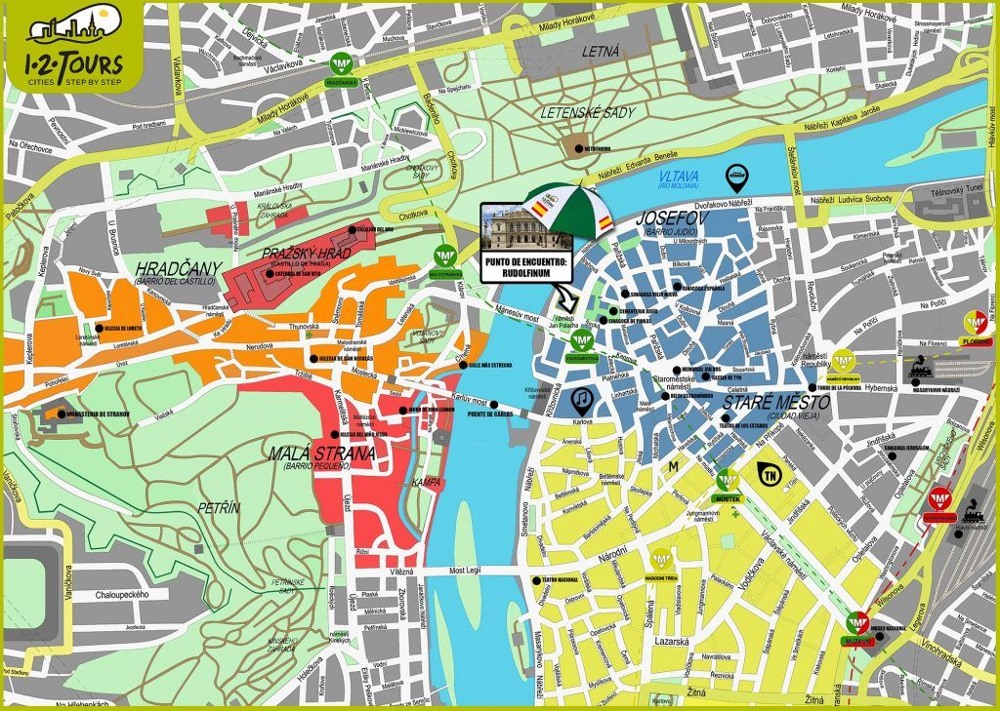

# Apéndice 
 

## 4.1 Recursos para aprender checo
En este apartado te dejo algunas páginas para que vayas practicando 😃
- [Aprede Checo](https://www.youtube.com/watch?v=XcB7mHn8N80)
- [LingoJump Language](https://www.youtube.com/watch?v=4mGGbdzisCU)
- [Imperium Linguarium](https://www.youtube.com/watch?v=r_EWPGIGGQg) 
- [Kosvision SM](https://www.youtube.com/watch?v=BT1UUWG7o4g) 

## 4.2 Mapa de Praga
Por último te dejo un par de mapas para que te comiences a ubicar.

## Mapa de Praga


## Mapa del Metro


Y por [acá](https://pragaturismo.net/mapas/) uno en PDF.

```¡Brzy se uvidíme!```

